# EchoSphere — Architecture (Current State)

This is a code-accurate map of the system as it exists in this repository today. It is derived by reading the running source code, container manifests, and test suites.

---

## 1. System Overview

EchoSphere is an enterprise-grade, real-time **AI Incident Commander** for high-severity technical outages (Sev-1). It joins the emergency voice bridge alongside engineering responders, organizes messy conversational speech and live telemetry into a structured knowledge graph, identifies factual contradictions, tracks action items, and **never asserts or guesses the root cause itself** (Rule 1).

### The Three Trust Zones

| Zone | Where | Holds | Responsibility | Security Boundary |
|---|---|---|---|---|
| **Zone 1** — Browser Console | `frontend/src/components/**`, `frontend/src/hooks/**` | UI state via `incidentReducer` | Interactive topology graph, transcripts, theories matrix, telemetry probes | Never sees or imports Agora or LLM credentials |
| **Zone 2** — Next.js Server | `frontend/src/lib/server/**`, `frontend/src/app/api/**` | Agora App ID, Certificate, Customer secret | Mints short-TTL tokens, manages roster, starts Agora agents | Marked `server-only`; never handles raw incident analysis |
| **Zone 3** — Python Slow Loop | `backend/app/**` | Groq keys, LLM pipeline, Evidence Ledger, DB connections | Analysis, extraction, contradiction deliberation, tool execution | Private backend; remote access strictly gated by `AGENT_TOOL_SECRET` |

---

## 2. Comprehensive System Architecture Diagram

```mermaid
flowchart TD
    %% ─────────────────────────────────────────────────────────────
    %% STYLING & CLASSES
    %% ─────────────────────────────────────────────────────────────
    classDef edgeVoice fill:#1e293b,stroke:#38bdf8,stroke-width:2px,color:#f8fafc;
    classDef fastLoop fill:#0f172a,stroke:#818cf8,stroke-width:2px,color:#f8fafc;
    classDef slowLoop fill:#1e1e2e,stroke:#34d399,stroke-width:2px,color:#f8fafc;
    classDef dataStore fill:#18181b,stroke:#f59e0b,stroke-width:2px,color:#f8fafc;
    classDef consoleUI fill:#0c4a6e,stroke:#0284c7,stroke-width:2px,color:#f8fafc;
    classDef securityGate fill:#450a0a,stroke:#ef4444,stroke-width:2px,color:#fecaca;

    %% ─────────────────────────────────────────────────────────────
    %% EDGE & FAST LOOP (Voice Interactivity)
    %% ─────────────────────────────────────────────────────────────
    subgraph Edge ["1. Voice Edge & Fast Loop (Sub-Second Latency)"]
        Mic[Human Responders<br/>Microphones & RTC]:::edgeVoice -->|WebRTC Audio| SD_RTN[Agora SD-RTN Audio Bridge]:::edgeVoice
        SD_RTN -->|Raw Audio Stream| Deepgram[Agora-Managed Deepgram Nova-3 ASR]:::fastLoop
        Deepgram -->|Transcribed Text| FastAgent[Agora Cloud Agent<br/>Groq gpt-oss-120b]:::fastLoop
        FastAgent -->|Spoken Response| MiniMax[MiniMax / ElevenLabs TTS]:::fastLoop
        MiniMax -->|Synthesized Audio| SD_RTN
    end

    %% ─────────────────────────────────────────────────────────────
    %% SECURITY & INGRESS
    %% ─────────────────────────────────────────────────────────────
    subgraph Ingress ["2. Secure Gateway & Ingress"]
        Tunnel[Cloudflare Quick Tunnel<br/>https://*.trycloudflare.com]:::securityGate
        SecGate["Tunnel Gate Middleware<br/>X-Echo-Tool-Token / HMAC-SHA256<br/>Fail-Closed Security"]:::securityGate
        FastAgent -->|Webhook Tool Call| Tunnel
        Tunnel --> SecGate
    end

    %% ─────────────────────────────────────────────────────────────
    %% SLOW LOOP CORE (FastAPI Privileged Analytics)
    %% ─────────────────────────────────────────────────────────────
    subgraph SlowLoop ["3. Slow Loop Privileged DDD Core (Port 8000)"]
        SecGate -->|query_incident_state / probe_telemetry| ToolRouter[Tools Router<br/>app/web/routers/tools.py]:::slowLoop
        SD_RTN -.->|RTM Transcripts| IngestRouter[Ingest Router<br/>/observer/transcript]:::slowLoop
        
        IngestRouter --> ConsentGate{"Consent Gate<br/>app/domain/policies/privacy.py<br/>'Off-the-record' check"}:::securityGate
        ConsentGate -->|Allowed| Redactor[PII & Credential Redaction<br/>app/domain/policies/redaction.py]:::slowLoop
        Redactor --> TurnWindow[Turn Windowing Buffer<br/>1.5s silence / 8-frame cap]:::slowLoop
        
        TurnWindow --> Extraction[LLM Claim & Entity Extraction<br/>app/application/services/extraction.py]:::slowLoop
        Extraction --> Reconciler[Entity Reconciler & Alias Promotion<br/>app/domain/policies/reconciliation.py]:::slowLoop
        
        Reconciler --> Ledger[Evidence Ledger Aggregate Root<br/>app/domain/ledger.py]:::slowLoop
        ToolRouter -->|Deterministic Direct Read| Ledger
        
        Ledger --> ContradictionEngine[Contradiction Engine<br/>app/domain/policies/contradiction.py]:::slowLoop
        ContradictionEngine --> DelibPanel[Deliberation Panel<br/>Skeptic vs Seeker + Referee<br/>app/domain/policies/panel.py]:::slowLoop
        
        DelibPanel -->|Opposed Verdict| UtteranceGen[Rule 1 Anti-Causal Utterance Validator<br/>app/domain/policies/utterance.py]:::securityGate
        UtteranceGen -->|Validated Sentence| SpeechCoord[Speech Coordinator<br/>app/application/services/speech.py]:::slowLoop
        SpeechCoord -->|POST /agents/id/speak| FastAgent
        
        Ledger --> ElimMatrix[Hypothesis Elimination Matrix<br/>app/domain/services/elimination.py]:::slowLoop
        ElimMatrix <-->|Live Metrics| TelemService[Telemetry Service<br/>app/domain/services/telemetry.py]:::slowLoop
    end

    %% ─────────────────────────────────────────────────────────────
    %% EVENT STREAMING & PERSISTENCE
    %% ─────────────────────────────────────────────────────────────
    subgraph Storage ["4. Streaming Backbone & Multi-Tier Persistence"]
        RedisBus[("Redis 7 Streams Backbone (Port 6379)<br/>echosphere:deltas<br/>echosphere:claims")]:::dataStore
        QdrantDB[("Qdrant Vector DB (Port 6333)<br/>Collection: echosphere_claims<br/>384-d Dense Semantic Embeddings")]:::dataStore
        PostgresDB[("PostgreSQL 16 (Port 5434)<br/>Durable Relational Ledger")]:::dataStore
        SQLiteStore[("SQLite WAL Event Store<br/>Local In-Process Persistence")]:::dataStore

        Ledger -->|Mirror Claims| RedisBus
        Ledger -->|Upsert Vectors| QdrantDB
        Ledger -->|Background Mirror| PostgresDB
        Ledger -->|Append-Only Events| SQLiteStore
        ContradictionEngine <-->|Cosine Similarity Queries| QdrantDB
    end

    %% ─────────────────────────────────────────────────────────────
    %% OPERATOR DASHBOARD & REALTIME BROADCAST
    %% ─────────────────────────────────────────────────────────────
    subgraph Operations ["5. Incident Command Console (Port 3100)"]
        DeltaHub[DeltaHub Broadcaster<br/>app/infrastructure/deltas.py]:::slowLoop
        Ledger --> DeltaHub
        DeltaHub -->|WebSocket /ws/deltas| ConsoleClient[Next.js 16 Incident Console<br/>React 19 + @xyflow/react]:::consoleUI
        ConsoleClient --> Reducer["Single State Reducer<br/>src/lib/incident-reducer.ts<br/>Idempotent SNAPSHOT / REPLAY"]:::consoleUI
        
        Reducer --> TopoGraph[Interactive Topology Graph]:::consoleUI
        Reducer --> TheoriesPanel[Hypothesis Elimination Panel]:::consoleUI
        Reducer --> EvidenceLedgerUI[Attributed Evidence Ledger]:::consoleUI
        Reducer --> AuthGateUI[Two-Channel Nonce Authorization Gate]:::consoleUI
        
        AuthGateUI -->|Click Approval| ActionProxy[Proxy Action Layer<br/>app/domain/policies/proxy.py]:::securityGate
    end
```



---

## 3. The Two Loops (Core Design Invariant)

```
 FAST LOOP  (Voice Bridge, sub-second)          SLOW LOOP  (Analytical Engine, ~2-4s)
 ────────────────────────────────────           ─────────────────────────────────────
 Agora Cloud Agent                              FastAPI Zone 3 Backend
 (Deepgram Nova-3 -> Groq -> MiniMax/TTS)       (Turn Windowing -> Extraction -> Ledger)

 mic audio ──► Deepgram ASR ──► LLM ──► TTS     transcript ──► redact ──► extract ──► ledger
                                                  │                               │
                                                  ▼                               ▼
 reads facts via ──────────────────────────►   POST /tools/query_incident_state (ledger.query)
 (HTTP REST tool call via Cloudflare Tunnel)    [100% deterministic database read, NO LLM]

 is told what to say ◄──────────────────────   BridgeController.speak() / speak_now()
 (Exact proactive speech injection)             [Validated via utterance.py anti-causal tripwire]
```

### Invariants Enforced Structurally
1. **The Fast Loop never writes to the Ledger.** It can only query facts via `query_incident_state`.
2. **The Fast Loop never answers from unverified memory.** When tools are enabled, prompt Rule 3 directs the model to read the Ledger.
3. **The Slow Loop never speaks diagnosing sentences.** `backend/app/domain/policies/utterance.py` validates every sentence before `/speak` is called. If causal phrasing is detected, it raises `EpistemicViolation` rather than voicing it.

---

## 4. Multi-Tier Storage & Event Streaming

1. **Redis 7 Streams (`app/infrastructure/redis_bus.py`)**:
1. **Redis 7 Streams (`app/infrastructure/redis_bus.py`, `app/application/services/worker.py`)**:
   - Ingests high-frequency audio transcripts to `echosphere:ingest:events`.
   - Consumed by distributed `StreamExtractionWorker` pool via Consumer Groups (`XREADGROUP`, `XACK`).
   - Streams every UI delta to `echosphere:deltas`.
   - Streams every extracted claim to `echosphere:claims:{channel}`.
   - Provides distributed atomic locking (`SET NX PX`) to prevent duplicate window extractions.
   - Powers sliding-window token bucket rate limiting in `app/web/middleware.py`.
   - Degrades gracefully to in-memory queues if Redis is unavailable.
2. **Qdrant Vector DB (`app/infrastructure/vector_store.py`)**:
   - Generates deterministic 384-dimensional dense semantic feature vectors with L2 normalization (zero external API cost, offline safe).
   - Manages collection `echosphere_claims` with payload filtering by `channel`.
   - Active Working Collection: `echosphere_claims` with payload filtering by `channel`, purged on `/incident/reset` to satisfy session privacy (v6 §10.4).
   - Permanent Historical Collection: `echosphere_historical` indexing postmortem summaries across resolved incidents for cross-incident precedent RAG (`GET /incident/search` and `POST /tools/query_historical_incidents`).
   - Used by `app/domain/policies/contradiction.py` to calculate hybrid similarity (40% lexical Jaccard + 60% dense cosine similarity) for contradiction candidate scoring.
   - Purged on `/incident/reset` to satisfy session privacy (§10.4).
3. **Dual-Tier Relational & Event Persistence (`app/infrastructure/store.py`, `event_store.py`)**:
3. **Decoupled Audio Ingest Sidecar (`services/audio-ingest`, `app/domain/services/rti.py`)**:
   - Containerized Python 3.11 microservice bridging native Agora RTC C-extensions (`agora-python-server-sdk`) to Python 3.14.
   - Pushes acoustic telemetry (RMS energy, speaking overlap, VAD activity) to `/observer/acoustic_telemetry`.
   - Evaluated by `RoomTensionService` with normalized multi-factor weighting and Schmitt-trigger hysteresis.
4. **Dual-Tier Relational & Event Persistence (`app/infrastructure/store.py`, `event_store.py`)**:
   - Primary: PostgreSQL 16 on port `5434:5432` with volume `echosphere-pgdata`.
   - Local Fallback: SQLite with Write-Ahead Logging (WAL) in `backend/data/incident_events.db`.
   - Auto-archives complete Sev-1 postmortems to SQLite before any incident reset.

---

## 5. Directory & File Reference

| Module | Location | Purpose |
|---|---|---|
| Evidence Ledger | `backend/app/domain/ledger.py` | Aggregate root for claims, entities, contradictions, timeline |
| Epistemic Models | `backend/app/domain/models.py` | `Claim` (`OBSERVED`, `TOOL_RESULT`, `HYPOTHESIS`, `INFERRED`), `Entity`, `Task` |
| Deliberation Panel | `backend/app/domain/policies/panel.py` | 3-agent deliberation (Skeptic vs Seeker + Referee) |
| Contradiction Engine | `backend/app/domain/policies/contradiction.py` | Two-stage conflict detection with lexical + vector cosine scoring |
| Anti-Causal Tripwire | `backend/app/domain/policies/utterance.py` | Composes and verifies non-causal speech |
| Hypothesis Matrix | `backend/app/domain/services/elimination.py` | Cross-references hypotheses with telemetry to refute false theories |
| Telemetry Probing | `backend/app/domain/services/telemetry.py` | Live metric probing across Datadog, Prometheus, AWS CloudWatch |
| Redis Bus Adapter | `backend/app/infrastructure/redis_bus.py` | Redis Streams publisher and distributed lock coordinator |
| Qdrant Adapter | `backend/app/infrastructure/vector_store.py` | Dense vector embedding generation and cosine similarity search |
| Tunnel Gate | `backend/app/web/middleware.py` | Fail-closed token and HMAC signature verification for remote requests |
| Command Console | `frontend/src/components/IncidentConsole.tsx` | Mission-control UI layout and interactive incident dashboard |
| Incident Reducer | `frontend/src/lib/incident-reducer.ts` | Single source of frontend state, idempotent delta/snapshot merger |

