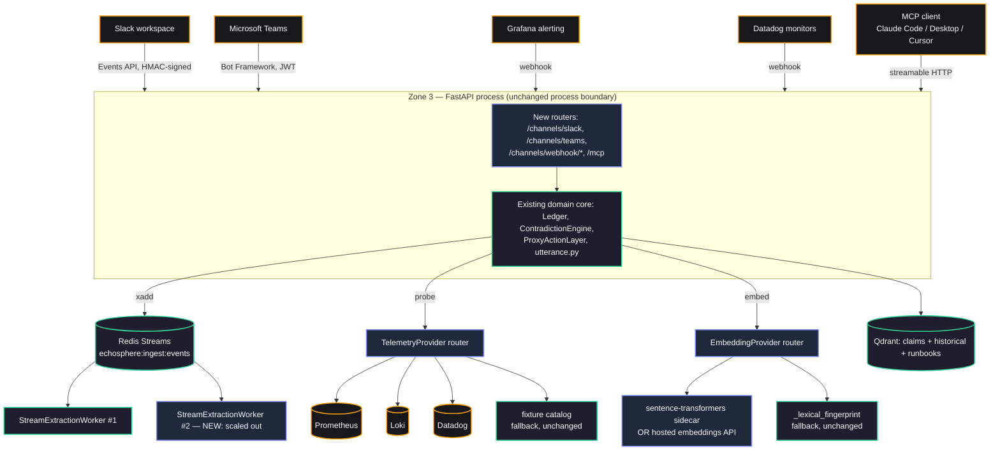

# EchoSphere — Architecture v2 (Proposal)

> **What this document is.** `ARCHITECTURE.md` describes the system as it runs today.
> This document is a **proposal** for where it goes next — ChatOps (Slack, Teams), an
> MCP server, real observability integrations (Datadog, Prometheus, Grafana, Loki), a
> real embedding model, and a streaming backbone that scales past one process. Nothing
> here is built yet. Every section is explicit about what exists today, what's
> genuinely missing, and why the proposed shape is the one that fits — grounded in the
> actual source, not the aspirational language some of the current docs use (e.g.
> `ARCHITECTURE.md` describes the telemetry service as querying "Datadog, Prometheus,
> AWS CloudWatch" — it does not; it returns a hardcoded fixture catalog with those
> labels attached. That gap is exactly what §7 below closes.)
>
> **The one rule every section below is written to obey**: nothing proposed here is
> allowed to weaken the two structural guarantees the whole product is built on —
> (1) every claim carries a real source and an epistemic status, and (2) Echo never
> asserts root cause. A Slack bot, a Teams bot, an MCP server, and three observability
> adapters are new **ports and adapters** into the existing hexagonal core — none of
> them are a new place for business logic to live.

---

## 1. Why change anything

The current system (see `ARCHITECTURE.md`) is built correctly for what it is: a
single voice bridge, one incident at a time, with a genuinely novel epistemic
discipline enforced structurally rather than by convention. Its gaps are not bugs so
much as **scope** — the product has exactly one input channel (Agora voice) and one
"telemetry" source (a fixture catalog naming real vendors it doesn't call). Three
things are motivating this proposal:

1. **Incident response already lives in Slack/Teams.** Voice is for the room; the
   async trail — who said what, who approved what, what's still open — is expected in
   the channel the org already uses for incidents. Right now that trail only exists
   on a dashboard nobody outside the bridge sees.
2. **The telemetry layer is fictional.** `TelemetryService`'s catalog (`redis`,
   `postgres`, `checkout`, `network`, `stripe` — five hardcoded entries with baked-in
   numbers) is what the hypothesis-elimination matrix and `probe_telemetry` tool
   actually query. It is a good **contract** — `TelemetryReading` → `TOOL_RESULT`
   claim is exactly the right shape — with no real backend behind it.
3. **The vector store is a hash, not an embedding**, and one declared tool
   (`lookup_runbook`, tiered `READ` in `proxy.py`'s `TIERS` dict) has **no
   implementation anywhere** — not in `tools.py`, not in the Agora tool schema in
   `agent-config.ts`. It's a contract with nothing behind it, exactly like telemetry.

None of this needs a rewrite. The domain core (`Ledger`, `Claim`/`epistemic_status`,
`ContradictionEngine`, `AuthorizationGate`/`ProxyActionLayer`, the anti-causal
`utterance.py` gate) is the right foundation for all of it — it just needs new
**adapters** at its edges, mirroring the hexagonal shape `ARCHITECTURE.md` §1 already
describes for Zones 1–3.

---

## 2. The one structural change everything else depends on: a Channel port

Today, "the Observer" is really "Agora voice, hardcoded." `/observer/transcript`
accepts a `{uid, role, text, isFinal}` shape that is Agora's shape, not a generic
one; outbound speech goes through `SpeechCoordinator` → the Agora agent's `/speak`
webhook and nothing else. Adding Slack and Teams by bolting two more routers directly
onto `ingest.py` and `speech.py` would work today and rot immediately — three
special cases where there should be one interface with three implementations.

### 2.1 The port

```python
# backend/app/application/ports/channel.py  (NEW)

class InboundMessage(Protocol):
    channel_id: str          # this platform's own room/thread id
    external_user_id: str    # Slack user id / Teams AAD object id / Agora RTC uid
    display_name: str | None
    text: str
    is_final: bool           # voice: false until ASR finalizes; chat: always true
    platform: Literal["voice", "slack", "teams", "webhook", "mcp"]

class ChannelAdapter(Protocol):
    """One implementation per platform. Nothing above this line knows Slack
    or Teams exist — Slack and Teams knowledge lives entirely in the adapter."""

    async def ingest(self, raw_event: Any) -> InboundMessage | None:
        """Parse a platform-native payload into the shape ingest.py already
        expects. Returns None for events that carry no attributable speech
        (a Slack reaction, a Teams typing indicator)."""

    async def deliver(self, channel_id: str, text: str, *, priority: str = "normal") -> None:
        """Say `text` on this platform — speak it (voice), post it (Slack/Teams).
        Every caller of this already went through `utterance.py`'s validator;
        the adapter's only job is transport."""

    async def request_approval(self, channel_id: str, approval: ApprovalRequestWire) -> None:
        """Render a CRITICAL action's approval prompt in this platform's own
        UI — a dashboard modal today, a Slack Block Kit message or a Teams
        Adaptive Card tomorrow. The REDEMPTION webhook (§4.2) is what actually
        grants authority; this only renders the prompt."""
```

`/observer/transcript` becomes the voice `ChannelAdapter`'s `ingest()` translated by
a thin router; nothing in `extraction.py`, `ledger.py`, `contradiction.py`, or
`utterance.py` changes at all. This is the same pattern the codebase already uses for
`TelemetryService` vs. a real provider (§7) — a port the domain depends on, adapters
that implement it, degrading or swapping without touching the core.

### 2.2 What this fixes that isn't about Slack or Teams at all

`InboundMessage.external_user_id` is **platform-verified identity** — Slack and
Teams both hand you an OAuth-backed, cryptographically-asserted user id on every
event; there is no equivalent for Agora voice (a numeric UID the client picks at
join time, per the audit that produced `backend/app/web/routers/bridge.py`'s
`/bridge/roster` — see `ARCHITECTURE.md`'s security model and the fix history in
`app/web/routers/approval.py`). Routing Slack/Teams through this port means their
roster entries can be populated from a **real, unforgeable identity** from day one,
which is strictly better than the voice channel's current UID-based one. It does not
retroactively fix voice — that needs its own project (SSO-linked join tokens) — but
it stops the gap from getting a third instance to fix later.

---

## 3. Slack integration

### 3.1 Why Slack first

Of the two chat platforms named, Slack is the lower-risk, higher-value one to build
first: Slack's Bolt SDK is a thin, well-documented layer over a webhook-shaped API
that maps directly onto the `ChannelAdapter` port above, and most of this product's
target users are already running their incident channel there.

### 3.2 Shape

A new adapter, `backend/app/infrastructure/channels/slack_adapter.py`, plus one new
router `backend/app/web/routers/slack.py` mounted at `/channels/slack/events`
(Slack's Events API webhook target). Runs **in the same FastAPI process** — this is
not a reason to stand up a new service; Slack's payload verification (HMAC over the
raw body + timestamp, replay-windowed) is structurally identical to the tunnel
gate's own `verify_hmac` in `middleware.py`, so the request-verification code is
reused, not reinvented.

```
Slack workspace
   │  message posted in #incident-4417
   ▼
Slack Events API  ──HTTPS webhook, HMAC-signed──▶  POST /channels/slack/events
                                                          │
                                                          ▼
                                        SlackAdapter.ingest(raw_event)
                                          → InboundMessage(platform="slack",
                                                            external_user_id=slack_user_id,
                                                            text=..., is_final=True)
                                                          │
                                                          ▼
                                   same ingest.py path every other channel uses:
                                   consent gate → redaction → TurnWindow → extraction
```

Outbound: `SpeechCoordinator` (renamed conceptually to a **Delivery Coordinator** in
v2, same class) fans a validated sentence out to every channel attached to the
incident — the voice bridge AND the linked Slack channel both hear/see "Filed as
INC-0042, approved by Priya. No infrastructure was changed by me — a human executes
it," worded identically because it passed through the same `utterance.py` gate once.

### 3.3 Approvals in Slack

`ProxyActionLayer.invoke()` already returns `PENDING_APPROVAL` with a nonce and a
required role (`app/domain/policies/proxy.py`) — nothing about that changes. The
Slack adapter's `request_approval()` posts a Block Kit message with **Approve** /
**Deny** buttons; Slack's `interactive` payload (also HMAC-signed) hits a second
route, `/channels/slack/interactions`, which does nothing more than translate the
button click into the exact same `POST /approval/redeem` call
`ApprovalModal.tsx` makes today — `uid` becomes the Slack user id looked up against
the `/bridge/roster` entry populated in §2.2, `role` is looked up server-side exactly
as `approval.py` already does. **A Slack user cannot approve anything the roster
doesn't say they're authorized for** — same rule, same code path, new front door.

### 3.4 What Slack is good for beyond approvals

- `/echo status` slash command → `query_incident_state` (already a pure, deterministic
  read; zero new logic, just a new caller).
- `/echo ask <question>` → routes into the same Fast-Loop-style Q&A the voice agent
  does today, but answered by the Slow Loop directly for a channel with no voice
  agent at all (a Slack-only "incident" is a real, valid product shape once this
  exists — a war room that never opens a voice bridge).
- Automatic posting of contradiction alerts, new CRITICAL claims, and the close-out
  summary (`ledger.close_out`) into the thread — the passive "narrative record" this
  product's whole thesis is that voice conversations don't produce on their own.

---

## 4. Microsoft Teams integration

Architecturally identical to Slack — a second `ChannelAdapter` implementation,
`teams_adapter.py`, a second router at `/channels/teams/messages`. The differences
that actually matter:

- **Auth is Azure Bot Framework**, not a shared HMAC secret: the bot needs an App ID
  + App Password registered with Azure, and incoming activity is validated via a JWT
  bearer token whose signature is checked against Microsoft's published JWKS — a
  materially different (and more involved) verification path than Slack's, needing
  its own small library (`botbuilder-core`'s Python SDK, or a hand-rolled JWKS
  verifier if avoiding that dependency is preferred) rather than reusing
  `middleware.py`'s `verify_hmac`.
- **Approvals render as Adaptive Cards**, Teams' equivalent of Block Kit — same
  `request_approval()` contract, different JSON shape.
- Teams tends to matter more for enterprises already standardized on Microsoft 365;
  it is placed after Slack and after the MCP server in the phased plan (§10) on pure
  value-per-effort grounds, not because it's architecturally harder in the ways that
  matter here.

**Recommendation:** build the Slack adapter first and let it prove the
`ChannelAdapter` port's shape is right in production before writing Teams against it
— a second implementation is where an interface's wrong assumptions actually surface.

---

## 5. An MCP server

### 5.1 Why this is the cheapest high-value addition

Everything an MCP server needs to expose already exists as a clean, already-decoupled
tool surface: `tools.py`'s four endpoints (`query_incident_state`, `probe_telemetry`,
`query_historical_incidents`, `invoke`) are already pure, already side-effect-scoped
through `ProxyActionLayer`, and already described with a JSON-schema shape in
`agent-config.ts`'s tool definitions (`name`, `description`, parameter schema) —
exactly the shape MCP tools are declared in. This is a **translation layer**, not new
logic:

```
backend/app/web/mcp/server.py   (NEW)

Tool: query_incident_state   →  session().ledger.query(scope, entity)      [unchanged]
Tool: probe_telemetry        →  telemetry_service.probe(...)               [unchanged]
Tool: query_historical_incidents → vector_store.search_historical_postmortems(...)
Tool: invoke_action           →  current.proxy.invoke(action, args, ...)   [unchanged]
```

### 5.2 Transport and mounting

Use the official `mcp` Python SDK's **streamable HTTP** transport (the current
spec's recommended transport for a server that isn't a local subprocess — stdio is
for Claude Desktop-style local tools, which this is not), mounted as a sub-application
at `/mcp` on the **same FastAPI process** rather than a new service. Reasoning:

- It needs the exact same session/registry/proxy objects `tools.py` already
  constructs per request via `deps.py` — running it elsewhere means either a second
  network hop back into this process or a second copy of the domain layer. Neither
  is worth it for what is fundamentally a protocol adapter.
- It needs the exact same tunnel-gate protection remote tool calls already get
  (`middleware.py`) — mounting elsewhere means re-deriving that gate.

### 5.3 Authorization

MCP tool calls carry credentials the same way `AGENT_TOOL_SECRET`/HMAC already gate
remote traffic — a client (Claude Code, Claude Desktop via a remote-MCP config,
Cursor, an internal LLM ops tool) authenticates with a per-workspace API key issued
out-of-band, checked in the same `tunnel_gate` middleware, on the same fail-closed
principle already documented there. **`invoke_action` for a CRITICAL tier still
returns `PENDING_APPROVAL` and stops** — an MCP client can request `page_oncall_team`
the same way Echo's voice agent can today, and gets exactly as far: a human still
approves on the dashboard (or in Slack, once §3 exists). MCP does not get to bypass
the two-channel authorization model; it's just one more way to *reach* the gate, not a
new gate.

### 5.4 What this actually unlocks

An engineer in Claude Code (or Cursor, or any MCP-aware assistant) working on the
service that's paging can ask "what does the incident ledger say about this?" and
get the same deterministic answer the voice agent gives, without opening the
dashboard or joining the bridge — and, for `lookup_runbook` (§7.4), get a real answer
for the first time anywhere in the system.

---

## 6. What "tools" means going forward

Two concrete, scoped additions beyond Slack/Teams/MCP as new *channels* for the
*same* tools:

1. **Actually implement `lookup_runbook`.** It's declared, tiered `READ`, and dead.
   §7.4 gives it a real backend once the vector store holds real runbook content.
2. **A new ADVISORY tool: `annotate_dashboard`** (e.g. Grafana annotations, §7.3) —
   filing a "we started failing over Redis at 14:32" marker onto the *actual*
   observability dashboard the responders are already looking at, sourced from a
   Ledger event. This is the proxy pattern (`_file()` in `proxy.py`) applied to a
   fifth real integration, not a new authorization tier.

No new tool changes the `TIERS` classification model in `proxy.py` — that
allow-list-by-action-name, fail-closed-to-`CRITICAL`-on-unknown design already scales
to an arbitrary number of tools without modification (`classify()`'s own docstring
says as much).

---

## 7. Real observability: Datadog, Prometheus, Grafana, Loki

### 7.1 The port

```python
# backend/app/application/ports/telemetry_provider.py  (NEW)

class TelemetryProvider(Protocol):
    async def probe(self, entity: str, metric: str | None) -> TelemetryReading:
        """Same return shape TelemetryService.probe() already produces —
        callers (probe_telemetry tool, elimination.py) do not change."""

    async def health(self) -> bool:
        """Is this provider actually reachable right now — used by /health,
        same pattern as redis_bus.is_enabled() / vector_store.is_enabled()."""
```

`TelemetryService` becomes a thin router over a **list** of configured providers
(mirroring `config.py`'s existing `analysis_providers()` pattern for Groq/Gemma
fallback exactly) — probing `redis.memory_utilization_pct` tries the provider that
owns `redis` in its configured entity map, and the fixture catalog becomes the
**last-resort fallback provider** when nothing real is configured, so a demo or a
laptop with no observability stack still works exactly as it does today. Nothing
about `Claim.epistemic_status = "TOOL_RESULT"` or the anti-causal tripwire in
`synthesize_claim()` changes — those guarantees live in the domain layer and don't
know or care which provider answered.

### 7.2 Prometheus + Loki (pull-based; build these first)

Both are self-hosted, both speak plain HTTP+JSON, and together they cover metrics
(Prometheus, via instant/range PromQL queries) and logs (Loki, via LogQL) — the two
signal types `elimination.py`'s hypothesis matrix actually needs. A single
`PrometheusProvider` translates `probe("redis", "memory_utilization_pct")` into a
configured PromQL template (`redis_memory_used_bytes{instance="$entity"} /
redis_memory_max_bytes{instance="$entity"} * 100`) via an entity→query mapping in
config, not hardcoded per-entity Python — an operator adds a new entity by editing
config, not code, closing the "narrow demo vocabulary" gap the original audit raised
about the hardcoded synonym clusters (`entity_resolver.py`) in the same spirit.
`LokiProvider` runs a LogQL count-over-time query and reports an elevated
error-log-rate as a `WARNING`/`CRITICAL` reading through the identical
`TelemetryReading` shape — a log spike becomes exactly the same kind of `TOOL_RESULT`
claim a metric threshold breach does today.

### 7.3 Grafana: two directions, and they're not the same feature

- **Pull**: Grafana's own HTTP API can resolve a **dashboard panel** to its
  underlying Prometheus/Loki query, so `probe_telemetry` can be configured against
  "the panel the on-call team actually looks at" rather than a hand-written PromQL
  string — a nicer authoring experience, same underlying `PrometheusProvider`.
- **Push**: Grafana's unified alerting can **webhook out** on an alert firing. This
  is a materially different, and arguably higher-value, integration: a new inbound
  route (`POST /channels/webhook/grafana`, same shape as the Slack/Teams webhook
  routers in §3–4, verified via a shared secret the same way) that turns a firing
  alert into a `TOOL_RESULT` claim **the moment it fires**, without anyone asking a
  probe question first. This is the same "signal push" this section proposes for
  Datadog (below) and PagerDuty-style tooling generally — see §8 for how this
  reaches the Ledger without becoming a second ingestion pipeline.

### 7.4 Datadog (commercial, build after the above prove the port out)

`DatadogProvider` calls the Metrics and Monitors v2 APIs the same way; the only
reason it's sequenced after Prometheus/Loki is that it needs paid API keys to
develop and test against, while Prometheus/Loki can be run locally in
`docker-compose.yml` for nothing. Datadog Monitors can also push via webhook exactly
like Grafana alerting (§7.3) — same inbound shape, same claim-synthesis path.

### 7.5 Runbook RAG — finally implementing `lookup_runbook`

A new Qdrant collection, `echosphere_runbooks`, ingested from wherever runbooks
actually live (Confluence export, a git-tracked docs folder, a wiki API) via a small
offline indexing script — out of the request path entirely, run on a schedule or on
docs-repo webhook, not during an incident. `lookup_runbook(entity, symptom)` embeds
the query (§9), retrieves the top-k runbook chunks, and returns them **as retrieved
text with a citation**, never as a model-authored answer — matching
`query_historical_incidents`' own existing discipline of returning attributed source
material rather than a synthesized summary.

---

## 8. Inbound signals don't get a second ingestion pipeline

Slack, Teams, Grafana-webhook, and Datadog-webhook are four different **producers**
of two different **shapes**: an attributed utterance (a human said something) or a
synthesized reading (a system reported something). Rather than four bespoke
ingestion paths, all four normalize to one of:

- `InboundMessage` (§2.1) → the existing `/observer/transcript`-equivalent path
  (consent gate → redaction → TurnWindow → extraction) for anything a human said.
- A `TelemetryReading` (§7.1) synthesized directly into a `TOOL_RESULT` claim via
  `telemetry_service.synthesize_claim()` — already exists, already anti-causal-gated
  — for anything a monitoring system reported, whether pulled by a probe or pushed by
  a webhook. **A webhook handler's only job is producing a `TelemetryReading` and
  handing it to the exact function `probe_telemetry` already calls.**

This is the same principle as §2's `ChannelAdapter`: new front doors, same one
hallway into the Ledger.

---

## 9. Vector store: from a hash to a real embedding, kept honest

### 9.1 The port

```python
# backend/app/application/ports/embedding_provider.py  (NEW)

class EmbeddingProvider(Protocol):
    async def embed(self, text: str) -> list[float]:
        ...
    @property
    def dim(self) -> int: ...
```

`vector_store.py`'s `_lexical_fingerprint` (named that, not "embedding," after the
prior audit — see that function's own docstring) becomes the **default, zero-config
fallback implementation** of this port, not something deleted — offline demos and a
laptop with no API budget keep working exactly as today. A configured provider
(local `sentence-transformers` served from a small sidecar container — no
per-request API cost, no external network call, keeps the "offline safe" property
the current hash approach has — or a hosted embeddings API for teams who'd rather
not run one more container) replaces it when set, following the exact `analysis_provider`
opt-in-config pattern already established in `config.py` for Groq/Gemma. **Every
Qdrant collection (`echosphere_claims`, `echosphere_historical`, and the new
`echosphere_runbooks`) needs re-indexing when the embedding provider or its
dimension changes** — `VECTOR_DIM` is currently a single constant; v2 makes it
per-collection so a migration doesn't force re-embedding data that hasn't moved
providers.

### 9.2 What actually improves

Real embeddings generalize past shared tokens — "the connection pool is exhausted"
and "we're out of available DB connections" currently score as unrelated (no shared
words); a trained embedding recognizes them as the same claim. This directly
improves `ContradictionEngine`'s candidate scoring (`contradiction.py`'s hybrid
lexical+cosine blend) and cross-incident search quality — both already wired to
*consume* a similarity score; only the thing producing it changes.

---

## 10. Streaming backbone: what "robust" means at scale

### 10.1 What's already right and shouldn't change

Redis Streams + consumer groups (`redis_bus.py`, `worker.py`) is the correct choice
at this product's actual current scale (one incident, one process) — it needs zero
extra infrastructure beyond the Redis container `docker-compose.yml` already runs,
degrades to in-memory gracefully exactly like every other optional dependency in
this codebase, and consumer groups already give at-least-once delivery semantics
with acknowledgment. None of the additions above need a different message bus.

### 10.2 What v2 actually needs to hParden

- **Every channel adapter's inbound event goes onto the same
  `echosphere:ingest:events` stream**, tagged with `platform` — one worker pool,
  one scaling story, one place `pipeline.run_if_ready` gets called from, regardless
  of whether the transcript came from Agora, Slack, or Teams.
- **Multiple worker processes, not just multiple consumers in one process.**
  `StreamExtractionWorker`'s consumer name is already stable per-host (fixed in the
  prior remediation pass specifically so `XAUTOCLAIM` can reclaim a crashed worker's
  pending entries); running N worker containers, each with its own consumer name,
  is the whole scaling story consumer groups exist for — no code change, an
  infrastructure/deployment one (`docker-compose.yml` gains a `worker` service
  scaled independently of the API process, instead of the worker running inside the
  same process as `main.py`'s lifespan today).
- **Schema-version every envelope** (`{"v": 1, "platform": "slack", ...}`) so a
  worker upgraded independently of a channel adapter (or vice versa) can reject or
  adapt to an unrecognized shape instead of crashing on it — the one piece of
  actual new discipline this section asks for, and cheap insurance against exactly
  the kind of "a hand-written field list drifts from what a model actually emits"
  failure class the prior remediation pass found repeatedly (schema.sql drift,
  the `_JSON_COLUMNS`/`_is_json_column` history) recurring in a new place.
- **Kafka/NATS is explicitly a non-goal for now.** It solves a scale problem (many
  millions of events/day across many concurrent incidents) this product does not
  have yet, at the cost of an operational dependency this project's whole
  philosophy — "a laptop with no Docker must still run the bridge" — argues
  against introducing before it's needed. Revisit only if/when multi-incident,
  multi-tenant usage (the thing `SessionRegistry` already supports structurally,
  per `ARCHITECTURE.md` §3, but nothing yet exercises) becomes real.

---

## 11. Data model additions

Minimal, additive, matching the existing dataclass-driven schema philosophy (add a
field, let `store.py`'s `_reconcile_schema` pick it up — see that function's own
docstring for why this is now a self-healing migration rather than a manual one):

| Model | New field | Why |
|---|---|---|
| `Transcript` | `platform: str` (`"voice"\|"slack"\|"teams"`) | Which channel this utterance actually arrived on — for audit and channel-specific rendering. |
| `Claim` | `source_ref: str \| None` | For a `TOOL_RESULT` claim: the Grafana panel URL / Datadog monitor id / Loki query that produced it — cited the same way `query_historical_incidents` already cites `archiveId`. |
| *(new)* `ChannelBinding` | `incident_id`, `platform`, `external_channel_id` | Which Slack channel / Teams thread / Agora RTC channel are all "the same incident" — needed the moment an incident has more than one attached surface, which is the entire point of §2. |

---

## 12. Security model: what's inherited, what's new

Everything in `ARCHITECTURE.md`'s three-zone model and the tunnel gate's fail-closed
design stays exactly as-is; new surfaces slot into it rather than beside it:

- Slack/Teams webhook routes get their **own** signature verification (§3–4), not
  the tunnel gate's `AGENT_TOOL_SECRET` — they're public-by-necessity the same way
  `/observer/transcript` is, and are gated the same category of way the prior
  remediation pass fixed that route to be (secret/signature required for any
  request that didn't arrive same-origin through the console's own proxy).
- The MCP server rides the *existing* tunnel gate (§5.3) — no new gate invented.
- **No new surface may write to the Ledger except through the same paths that exist
  today**: attributed speech through the consent→redaction→extraction pipeline, or a
  `TOOL_RESULT` claim through `synthesize_claim()`'s anti-causal tripwire. A webhook
  handler that tried to construct a `Claim` directly, bypassing either path, would be
  the one thing this whole document considers out of bounds.
- Slack/Teams' platform-verified identity (§2.2) should be treated as the reference
  design once it's proven out — the honest long-term fix for the voice channel's
  UID-based identity is a follow-on project, not something this document claims to
  solve for voice today.

---

## 13. New configuration surface

Following `config.py`'s existing `_optional`/opt-in pattern exactly — every one of
these is absent-by-default and the feature it gates simply doesn't activate, the
same way `GEMMA_BASE_URL` unset today means "Groq only, behavior unchanged":

```
# Slack
SLACK_BOT_TOKEN=
SLACK_SIGNING_SECRET=

# Microsoft Teams
TEAMS_APP_ID=
TEAMS_APP_PASSWORD=

# MCP server
MCP_API_KEYS=                 # comma-separated, same shape as GROQ_API_KEY_2/3

# Observability providers (per-provider; unset = that provider is skipped)
PROMETHEUS_URL=
LOKI_URL=
GRAFANA_URL=
GRAFANA_API_KEY=
DATADOG_API_KEY=
DATADOG_APP_KEY=
TELEMETRY_ENTITY_MAP=          # path to a YAML/JSON file: entity -> {provider, query template}

# Embeddings
EMBEDDING_PROVIDER=            # unset = _lexical_fingerprint fallback, as today
EMBEDDING_API_KEY=
EMBEDDING_BASE_URL=            # for a self-hosted sentence-transformers sidecar
```

---

## 14. Deployment topology



`docker-compose.yml` gains, all under existing optional-service conventions (a
missing container degrades the feature, never blocks startup):

- `worker` — the extraction worker as its own scaled service (§10.2), replacing
  in-process-only execution.
- `embeddings` — optional, only if the self-hosted sentence-transformers path is
  chosen over a hosted API.

No new *required* infrastructure. A laptop with none of this configured runs
identically to today.

---

## 15. Phased rollout

Ordered by value-per-effort and by what unblocks what — not a strict dependency
chain except where noted:

1. **Channel port refactor (§2).** Voice moves onto the new interface with zero
   observable behavior change. This is the only step every later phase depends on.
2. **MCP server (§5).** Fully independent of everything else; can run in parallel
   with step 1. Highest value-per-line-of-code in this whole document — it's a
   translation layer over code that already exists.
3. **Slack adapter (§3).** The highest-value new surface for actual incident
   response teams.
4. **Prometheus + Loki providers (§7.2), inbound webhook path (§8).** Unlocks real
   telemetry with zero paid dependencies; proves out the `TelemetryProvider` port
   before Datadog.
5. **Real embeddings (§9) + runbook RAG (§7.5), finally implementing
   `lookup_runbook`.**
6. **Datadog provider (§7.4), Grafana push path (§7.3).**
7. **Teams adapter (§4).**
8. **Streaming hardening for multi-worker scale (§10.2)** — deferred until usage
   actually demands it; premature here is its own risk.

---

## 16. Non-goals

- **No new authorization model.** `AuthorizationGate`'s nonce/TTL/args-hash/role
  design is unchanged; every new front door redeems through it, none replaces it.
- **No causal reasoning, anywhere, ever.** Every new claim-producing path
  (telemetry push, Slack message, MCP tool result) is a `Claim` with a real
  `epistemic_status`, gated by the same anti-causal tripwire the rest of the system
  already enforces in four independent places.
- **No multi-tenant / multi-incident rollout in this document.** `SessionRegistry`
  already supports it structurally; actually exercising it (routing, per-incident
  channel bindings at scale) is a separate proposal.
- **No Kafka, no service mesh, no new message bus** — see §10.2.

---

## 17. Open questions for the team

1. **Slack vs. Teams priority** — is there a specific customer/design partner
   already asking for one over the other? §15 assumes Slack-first on general
   incident-response-market grounds, not a specific commitment.
2. **Self-hosted vs. hosted embeddings** — does an operator's threat model allow
   incident text to leave the network to a hosted embeddings API at all? If not,
   the sentence-transformers sidecar is not optional, it's the only option, and
   that should be decided before §9 is built rather than after.
3. **Who owns `TELEMETRY_ENTITY_MAP`** — the entity→PromQL/LogQL mapping is real
   operational configuration a platform team maintains, not something this
   engineering team can author once and forget; worth deciding where that file
   lives and who reviews changes to it before real customers depend on it.
