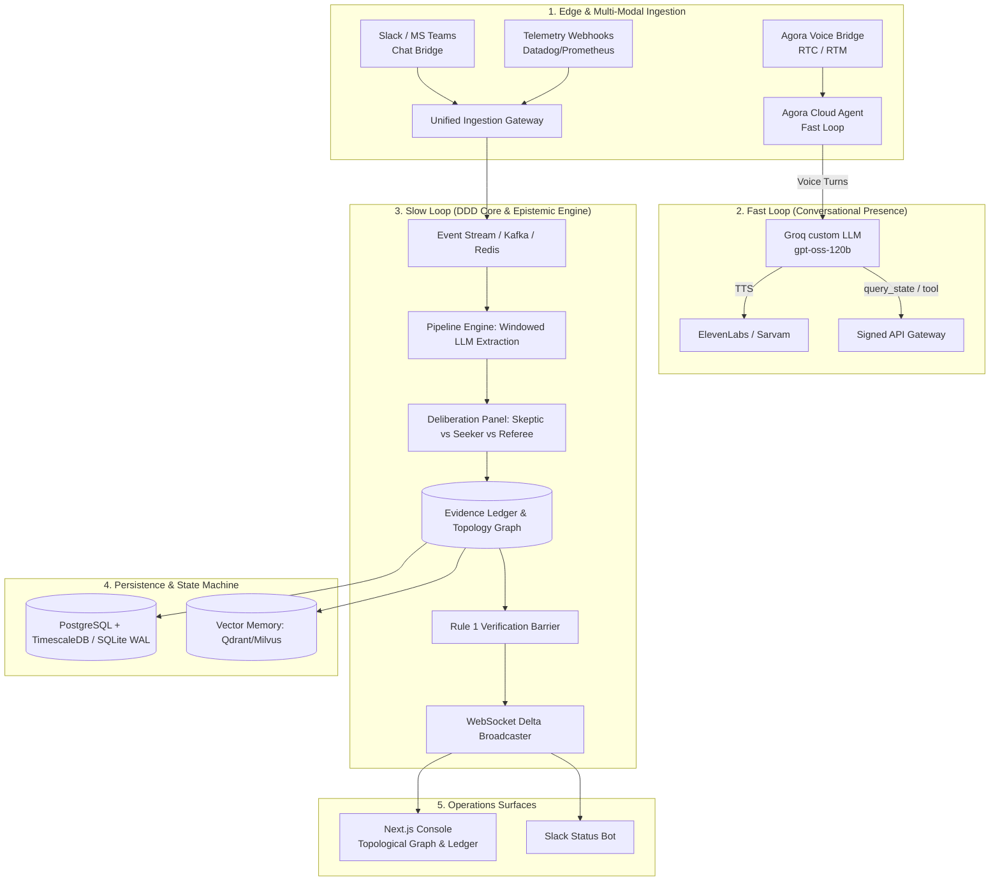

# EchoSphere: Comprehensive Platform Architecture Analysis & Production Outage Roadmap

> **Target**: EchoSphere Core Platform (Agora AI Incident Commander)  
> **Location**: Root Documentation (`/PLATFORM_ANALYSIS_AND_ROADMAP.md`)  
> **Governing Rubric**: Epistemic Discipline (Rule 1: Echo never determines root cause), Dual-Loop Latency Architecture, Zero-Trust Authorization.

---

## Executive Summary

EchoSphere possesses one of the most innovative and philosophically sound foundations in the AI operations space: **epistemic restraint as a moat**. While most incident AI projects attempt to "guess the root cause" (and fail catastrophically in production under noisy telemetry and incomplete facts), EchoSphere's core invariant—**Echo is a recording secretary and alignment referee, not a diagnostician**—matches how real-world Major Incident Response (MIM / SRE) actually operates.

This document presents a comprehensive, two-part strategic evaluation:
1. **Architectural Improvements**: Structural refinements to the codebase, distributed systems topology, data persistence, and ingestion pipelines to transform the prototype into an enterprise-grade platform.
2. **Real-World Incident Response Features**: High-impact capabilities engineered for live enterprise outages (AWS/Datadog/Kubernetes scale) that solve real friction points for Incident Commanders without violating epistemic boundaries.

---

## Part I: Platform Architecture Analysis & System Improvements



---

### 1. Architectural Bottlenecks & Strategic Upgrades

#### 1.1 In-Memory Volatility $\rightarrow$ Event-Sourced Persistence
* **Current State**: `IncidentState` in the backend (`app/domain/models.py`) and delta state in the frontend (`incident-reducer.ts`) are stored in volatile application memory. If the Python backend restarts or drops a worker, incident context is erased.
* **Architectural Fix**: 
  - Migrate state transitions to an **Append-Only Event Store** (Event Sourcing using PostgreSQL + TimescaleDB or SQLite with WAL mode).
  - Every transcript segment, extracted claim, topology mutation, contradiction verdict, and authorization is an immutable event (`IncidentEvent`).
  - **Benefits**:
    - Complete, byte-identical post-incident replayability.
    - Zero data loss on container restarts.
    - SOC2 / ISO27001 auditability (immutable proof of who said what and who authorized what).

#### 1.2 Ingestion Seam: Transition from RTM to Native Dual-Track Ingestion
* **Current State**: Audio is transcribed inside Agora's cloud and delivered as text over RTM. Real raw PCM audio processing is currently stubbed because `agora-python-server-sdk` lacks Python 3.14 wheels.
* **Architectural Fix**:
  - Decouple the RTC media connector into a lightweight sidecar container running **Python 3.11** or **Go / Rust** with Agora Native C++ SDK bindings.
  - Process raw PCM audio chunks directly with local VAD (Silero) and streaming Whisper/Deepgram.
  - **Benefits**:
    - True per-UID speaker acoustic analysis (measuring speech rate, jitter, volume, and conversational overlap for the Room Tension Index).
    - Eliminates dependency on cloud RTM relay.

#### 1.3 Tunnel Security & Tool Gateway Hardening
* **Current State**: Agora Cloud Agent communicates with the Slow Loop using an ngrok/localtunnel public URL and an `AGENT_TOOL_SECRET` bearer header.
* **Architectural Fix**:
  - Implement an Edge API Gateway (Cloudflare Worker / Envoy / AWS API Gateway) with **Mutual TLS (mTLS)** and cryptographic webhook signature verification (HMAC SHA-256).
  - Strict IP allowlisting matching Agora Cloud Agent egress IP ranges.
  - Fail-closed rate limiting to prevent tool-exhaustion Denial-of-Service during heavy voice bridges.

#### 1.4 Temporal Validity Windows for Evidence Ledger
* **Current State**: Claims in the Evidence Ledger carry a single timestamp `at: number`. In long-running outages, telemetry conditions change rapidly (e.g. *"Redis CPU is at 98%"* at 14:00 may be superseded by *"Redis CPU dropped to 12%"* at 14:15, yet the old claim remains unless explicitly superseded).
* **Architectural Fix**:
  - Introduce **Temporal Validity Intervals** to `Claim`:
    ```typescript
    interface Claim {
      id: string;
      text: string;
      validFrom: number;
      validUntil?: number | null; // null = currently active
      lifecycle: "ACTIVE" | "SUPERSEDED" | "REFUTED" | "EXPIRED";
    }
    ```
  - Auto-decay of ephemeral metrics: If a metric claim has no renewal after 10 minutes, Echo tags it as `STALE_METRIC` and prompts the team for fresh verification.

---

## Part II: High-Value Features for Real-World Engineering Outages

During severe production outages (P0/P1), engineering organizations face severe cognitive overload, fragmented communication across multiple tools, and fear of making the situation worse. The following features solve these exact pain points while respecting the EchoSphere epistemic rubric.

---

### 1. Active Telemetry Probing (Read-Only SRE Tool Execution)

* **The Real Problem**: Engineers hypothesize causes (*"Maybe Redis ran out of memory"*, *"Maybe the DB connection pool is exhausted"*), leading to 20-30 minutes of debates and wild-goose chases while latency climbs.
* **The Solution**: 
  - Connect Echo's Slow Loop to observability APIs: **Datadog, Prometheus, AWS CloudWatch, Grafana, OpenTelemetry**.
  - When an engineer utters a hypothesis, Echo does **not** validate the hypothesis. Instead, it extracts the entity and query target, fires a read-only query, and reports the raw metric as an `OBSERVED / TOOL_RESULT`:
  > *"Hypothesis recorded: Redis memory exhaustion. Querying Datadog: Redis primary memory usage is currently 34.2% (2.7GB / 8.0GB). Memory pressure is not observed."*
* **Why it Wins**:
  - Kills bad hypotheses in 3 seconds instead of 30 minutes.
  - Complies 100% with Rule 1: Echo reports the metric reading, not a diagnosis.

---

### 2. Multi-Channel Bridge: Bi-Directional Slack & MS Teams Sync

* **The Real Problem**: 70% of incident discussion, command outputs, and Grafana screenshot links are posted in a Slack incident channel (`#inc-4417`), while only 30% is spoken on the voice bridge. Voice-only tools are blind to critical shared context.
* **The Solution**:
  - Deploy an Echo Slack/Teams Bot that joins the incident room.
  - **Inbound**: Slack messages, pasted error logs, terminal snippets, and Datadog graph links are ingested into the same unified windowed extraction pipeline as audio transcripts.
  - **Outbound**: When the Deliberation Panel detects a contradiction or Echo identifies an unassigned critical gap, Echo posts a clean Slack Block Kit alert with interactive adjudication buttons:
    ```text
    ⚠️ EVIDENCE CONTRADICTION DETECTED
    • SRE (14:02): "Checkout service is down due to 504 gateway timeouts."
    • DevOps Lead (14:05): "Gateway logs show 200 OKs, failure is downstream in Stripe client."
    [Confirm SRE]  [Confirm DevOps]  [Keep Both Open]
    ```

---

### 3. Pre-Incident Infrastructure Topology Hydration (APM & CMDB)

* **The Real Problem**: Currently, Echo builds the System Topology Graph from scratch based only on entities mentioned by humans. If an engineer forgets that `BillingService` sits between `Checkout` and `PostgreSQL`, the graph has missing links.
* **The Solution**:
  - Connectors to **Kubernetes API, AWS CloudMap, Datadog Service Catalog, or OpenTelemetry Service Graphs**.
  - On bridge start, Echo pre-hydrates the baseline architecture map.
  - As nodes are mentioned in audio, Echo lights up existing topological nodes and highlights live dependencies that the human responders haven't investigated yet:
  > *"Checkout and Redis are under investigation. Note: OpenTelemetry shows Checkout also depends on AuthGateway and Vault. Neither has been discussed."*

---

### 4. Blast Radius & Customer Impact Calculator

* **The Real Problem**: Incident Commanders are constantly pressured by leadership to quantify customer impact: *"How many customers are failing? What is the revenue loss per minute? Are Enterprise customers impacted?"*
* **The Solution**:
  - Stream edge ingress metrics (Cloudflare, AWS ALB, Envoy).
  - Compute real-time business telemetry:
    - **Failed Requests / sec**
    - **Affected Tenant Tiers** (e.g. Free vs Enterprise)
    - **Estimated Revenue Burn Rate** (based on historical basket conversion value)
  - Displayed prominently in the Console Status Bar and included in executive status exports.

---

### 5. Automated Executive & Stakeholder Comms Synthesizer

* **The Real Problem**: The Incident Commander (IC) spends up to 40% of their bandwidth typing manual updates to executive Slack channels, customer support teams, and public status pages (Statuspage.io, Cachet).
* **The Solution**:
  - **1-Click Fact-Derived Communications Generator**:
    - Reads **strictly from `ESTABLISHED` (Observed & Tool Result) claims**.
    - Generates 3 tiered updates instantly:
      1. **Technical On-Call Sync**: Dense, metric-focused update for engineering teams.
      2. **Executive Summary**: Non-jargon, business-impact and timeline summary for VP/C-level leaders.
      3. **Public Status Page Draft**: User-facing explanation with sanitized technical details.
  - The IC reviews the draft, makes adjustments, and clicks **Publish to Statuspage**.

---

### 6. Two-Man Rule Cryptographic Authorization Gate for Mitigation Actions

* **The Real Problem**: In the chaos of an outage, dangerous mitigation actions (e.g. restarting a primary database, flushing a shared cache, dropping read replicas) are sometimes triggered accidentally or prematurely.
* **The Solution**:
  - Enterprise **Proxy Action Layer (PAL)** with strict Role-Based Access Control:
    - Low-risk actions (e.g. scaling up a pod replica count) require 1 approval.
    - High-risk actions (e.g. database failover, cache flush) require **Two-Man Rule**:
      1. Requested by SRE or Voice Trigger.
      2. Seconded by Incident Commander / DevOps Lead with biometric/WebAuthn confirmation.
  - Integrated rollback hooks: Every authorized action must include an automated rollback timeout if error rates don't drop within 180 seconds.

---

### 7. Shift Handoff & Asynchronous Audio Briefing ("The Catch-Up Brief")

* **The Real Problem**: When an incident crosses shift boundaries (e.g. US team handing over to Europe/APAC) or a new specialist joins the bridge 45 minutes in, they either interrupt the call to ask *"What did I miss?"* or read through 400 messages.
* **The Solution**:
  - When a new participant joins with a new UID, Echo's Fast Loop whispers a private synthetic audio briefing (or displays a 30-second summary card):
  > *"Incident 4417 active for 48 minutes. 4 facts established: 92% packet drop in us-east-1a, Redis cluster isolated, DB replica healthy, Auth operational. 1 active contradiction regarding cache eviction policy. Rollback of PR-204 authorized and running."*

---

### 8. Automated Post-Incident Review (PIR) & Blameless Retrospective Generator

* **The Real Problem**: Writing the post-mortem document after an outage is universally hated, takes days to compile, and is often inaccurate because people misremember the sequence of events.
* **The Solution**:
  - Immediately upon bridge close (`closeBridge`), Echo compiles an authoritative, blameless Post-Mortem Report in Markdown / Confluence / Notion format:
    - **Incident Timeline with Source Attribution**: Every utterance, measurement, and decision timestamped to the second.
    - **Key Metrics**: Time to Detect (TTD), Time to Assemble (TTA), Time to Identify (TTI), Time to Mitigate (TTM).
    - **Hypotheses Tested & Refuted**: Complete list of assumptions made, why they were considered, and the evidence that ruled them out.
    - **Preventative Action Items**: Extracted from unresolved risks and gaps recorded during the bridge.

---

## Part III: Implementation Priority Matrix

| Feature | Engineering Complexity | Enterprise Impact | Adherence to Rule 1 | Priority Phase |
|---|---|---|---|---|
| **Active Telemetry Probes (Datadog/Prometheus)** | Medium (FastAPI tools) | **Highest** | 100% (Reports raw data) | **Phase 1** |
| **Slack / Teams Bi-Directional Bridge** | Low–Medium (Webhooks) | **Highest** | 100% (Transcribes chat) | **Phase 1** |
| **Event Sourcing & SQLite/Postgres WAL** | Medium | High | 100% (Storage only) | **Phase 1** |
| **PIR & Retrospective Auto-Generator** | Low (Prompt template) | High | 100% (Timeline synthesis) | **Phase 2** |
| **Executive & Status Page Comms Engine** | Low | High | 100% (Established claims only) | **Phase 2** |
| **APM / OTel Topology Pre-Hydration** | High | High | 100% (Topology only) | **Phase 2** |
| **Customer Impact & Blast Radius Meter** | Medium | Medium | 100% (Metrics computation) | **Phase 3** |
| **Asynchronous Voice Catch-Up Brief** | Medium | Medium | 100% (Summarizes facts) | **Phase 3** |

---

## Conclusion

EchoSphere's moat is **epistemic discipline**. By expanding its input channels (Slack + APM), giving it read-only verification eyes (Datadog/Prometheus probes), and automating the administrative burden of incidents (Statuspage updates + Blameless PIRs), EchoSphere bridges the gap from an exceptional hackathon prototype to an indispensable enterprise incident commander.

