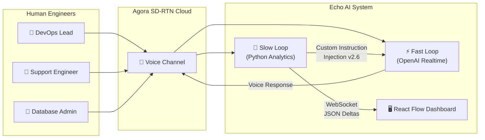
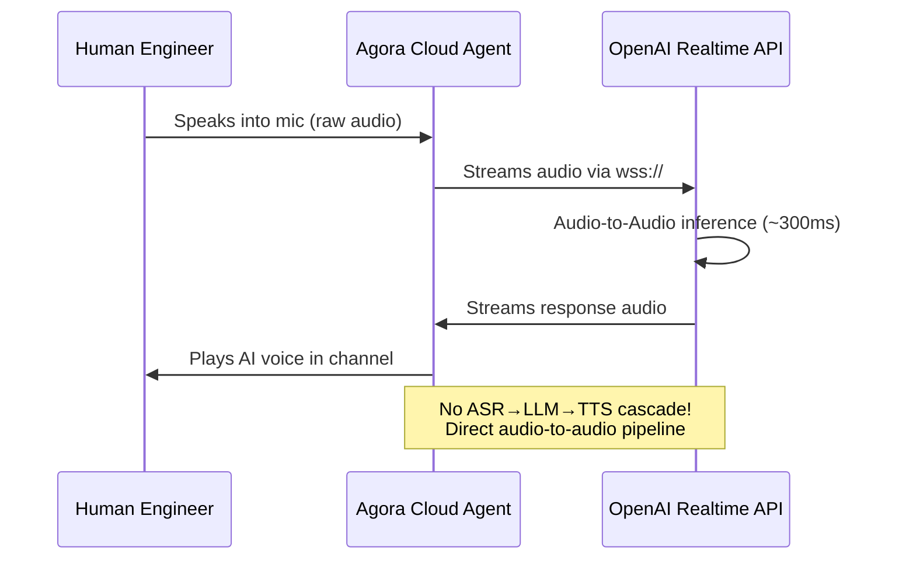
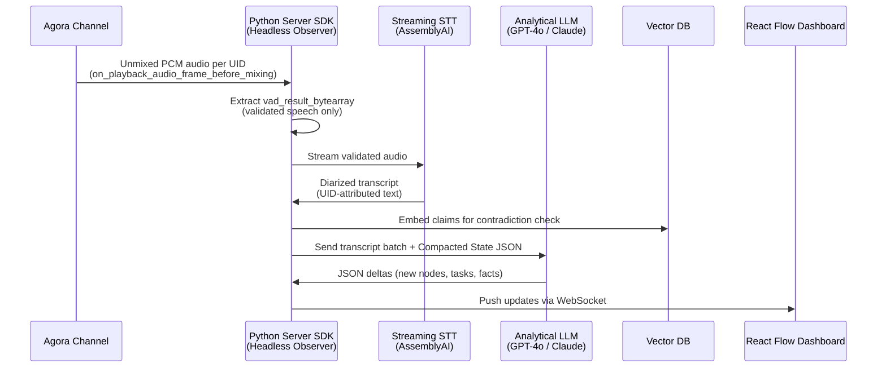
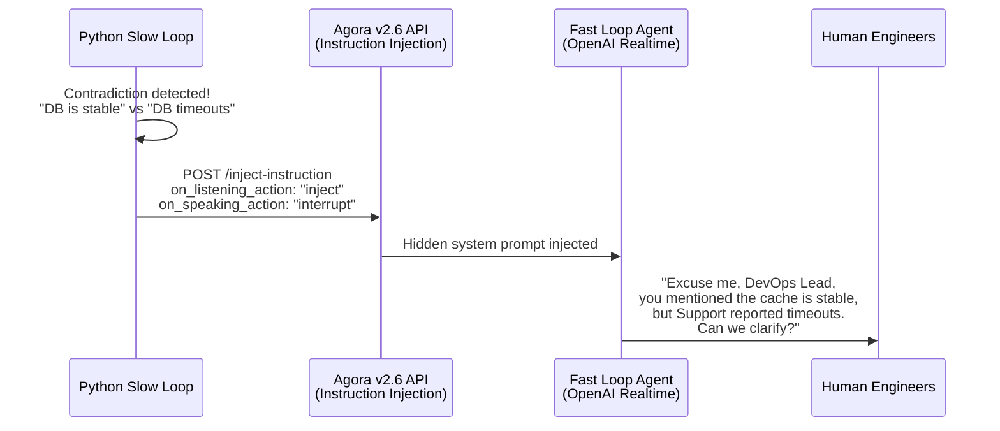
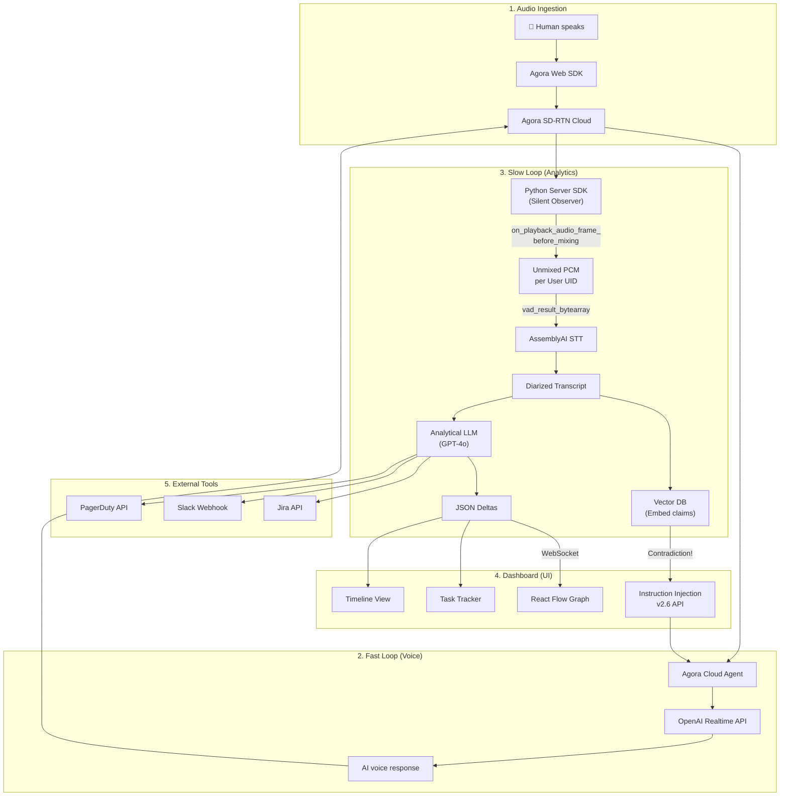

# 🛡️ EchoSphere Hackathon — Master Context Document

## Real-Time AI Incident Commander: "Echo"

> **Project Name:** Echo — Real-Time AI Incident Commander
> **Hackathon:** EchoSphere: Agora Conversational AI Hackathon
> **Track:** AI Incident Commander
> **Architecture Version:** Golden Master v5 (FINAL)
> **Last Updated:** August 24, 2026

---

## Table of Contents

1. [Problem Statement](#1-problem-statement)
2. [Solution Overview](#2-solution-overview)
3. [System Architecture — The Dual-Loop Design](#3-system-architecture--the-dual-loop-design)
4. [Tech Stack](#4-tech-stack)
5. [Data Flow Pipeline](#5-data-flow-pipeline)
6. [Requirement-to-Implementation Mapping](#6-requirement-to-implementation-mapping)
7. [Wow Factor Features](#7-wow-factor-features)
8. [Prompt Engineering Architecture](#8-prompt-engineering-architecture)
9. [Edge Case Mitigations &amp; Failure Modes](#9-edge-case-mitigations--failure-modes)
10. [Testing &amp; Security Frameworks](#10-testing--security-frameworks)
11. [Live Demo Script (Shark Tank Style)](#11-live-demo-script-shark-tank-style)
12. [Execution Timeline](#12-execution-timeline)
13. [Hackathon Calendar](#13-hackathon-calendar)

---

## 1. Problem Statement

Build a real-time AI Incident Commander that joins a live operational or technical incident room. The AI should:

- Listen to the discussion and organize information
- Help the team maintain a shared understanding of the incident
- Distinguish confirmed facts from assumptions
- Track decisions and maintain a timeline
- Follow up on unresolved actions

### Example Scenario

> A payment system experiences an outage. Engineers, support teams, and business leaders join the incident room and share incomplete or conflicting information. The AI should organize the evidence, track responsibilities, and keep the team aligned **without pretending to independently determine the root cause**.

---

## 2. Solution Overview

**Echo** is a voice-native AI agent that joins a live Agora voice channel as a participant. It uses a **Dual-Loop Architecture** to separate real-time voice interaction from heavy analytical processing, ensuring sub-second voice latency and flawless speaker diarization even during chaotic, overlapping conversations.



---

## 3. System Architecture — The Dual-Loop Design

The architecture is split into two completely independent processing loops to avoid the **Concurrency-Coherence Paradox** (where stale AI context causes incoherent responses).

### 3.1 The Fast Loop (Voice — Sub-second Latency)



| Parameter                       | Value                                | Purpose                                     |
| ------------------------------- | ------------------------------------ | ------------------------------------------- |
| **MLLM Vendor**           | `openai`                           | OpenAI Realtime WebSocket                   |
| **Model**                 | `gpt-4o-realtime-preview`          | Audio-to-audio multimodal                   |
| **WebSocket URL**         | `wss://api.openai.com/v1/realtime` | Persistent connection                       |
| **VAD Mode**              | `agora_vad`                        | Edge-optimized VAD                          |
| **interrupt_duration_ms** | `160`                              | 160ms continuous speech to trigger barge-in |
| **prefix_padding_ms**     | `800`                              | Captures 800ms before speech starts         |
| **silence_duration_ms**   | `640`                              | Waits 640ms before assuming turn is over    |
| **threshold**             | `0.5`                              | Balanced sensitivity                        |

### 3.2 The Slow Loop (Analytics — Perfect Diarization)



### 3.3 The Bridge (Slow Loop → Fast Loop)



---

## 4. Tech Stack

### Frontend

| Technology                             | Purpose                               |
| -------------------------------------- | ------------------------------------- |
| **Next.js 14** (App Router)      | Full-stack framework, API routes, SSR |
| **React Flow**                   | Dynamic incident graph visualization  |
| **TailwindCSS**                  | Premium, responsive styling           |
| **agora-rtc-sdk-ng**             | Voice channel (mic/speaker)           |
| **agora-rtm-sdk**                | Signaling (live transcripts)          |
| **Web Audio API (AnalyserNode)** | AI waveform visualization             |

### Backend (Fast Loop)

| Technology                      | Purpose                               |
| ------------------------------- | ------------------------------------- |
| **Next.js API Routes**    | `/api/token`, `/api/invite-agent` |
| **agora-agents (TS SDK)** | Cloud agent lifecycle management      |
| **agora-token**           | RTC/RTM token generation              |
| **OpenAI Realtime API**   | MLLM for audio-to-audio               |

### Backend (Slow Loop)

| Technology                              | Purpose                            |
| --------------------------------------- | ---------------------------------- |
| **Python 3.11 + FastAPI**         | Async HTTP/WebSocket server        |
| **agora-python-server-sdk**       | Headless channel observer          |
| **AssemblyAI Universal-3.5 Pro**  | Streaming STT (6.99% WER)          |
| **OpenAI text-embedding-3-small** | Claim embeddings for contradiction |
| **Pinecone / Qdrant**             | Vector DB for semantic search      |
| **GPT-4o / Claude 3.5 Sonnet**    | Analytical JSON extraction         |

### Infrastructure

| Technology                                    | Purpose                          |
| --------------------------------------------- | -------------------------------- |
| **Agora SD-RTN®**                      | Global real-time audio transport |
| **Agora RTM**                           | Metadata signaling channel       |
| **Agora Conversational AI Engine v2.6** | Custom Instruction Injection     |

---

## 5. Data Flow Pipeline



---

## 6. Requirement-to-Implementation Mapping

| #  | Problem Statement Requirement                            | Implementation                                                        | Component             |
| -- | -------------------------------------------------------- | --------------------------------------------------------------------- | --------------------- |
| 1  | Real-time participation in a live voice room             | Agora Cloud Agent joins the channel as a participant                  | Fast Loop             |
| 2  | Recognition of participant roles                         | UID-to-Role mapping at token generation (`/api/token`)              | Fast Loop             |
| 3  | Extraction of facts, hypotheses, decisions, action items | Analytical LLM outputs structured JSON from diarized transcripts      | Slow Loop             |
| 4  | Assignment and tracking of task ownership                | Auto-generated Jira tickets with role attribution from UID mapping    | Slow Loop + Dashboard |
| 5  | Detection of missing or conflicting information          | Vector DB cosine similarity + Semantic Contradiction Engine           | Slow Loop             |
| 6  | Continuously updated incident timeline                   | React Flow dashboard updated via WebSocket JSON deltas                | Dashboard             |
| 7  | Integration with Jira, Slack, PagerDuty                  | Proxy Action Layer in Python backend with API adapters                | Slow Loop             |
| 8  | Spoken status summaries at appropriate moments           | AI speaks when RTI spikes, contradiction found, or directly addressed | Fast Loop + Bridge    |
| 9  | Human confirmation before critical actions               | Verbal authorization + UI modal approval gate                         | Fast Loop + Dashboard |
| 10 | Final incident summary with unresolved risks             | AI generates structured close-out report on verbal command            | Fast Loop             |

---

## 7. Wow Factor Features

### 7.1 Dynamic Root-Cause Knowledge Graph (React Flow)

As the AI listens, infrastructure entities ("Redis Cache", "Payment Gateway") and causal links ("timeout causing") are extracted and pushed to React Flow. Nodes turn **red** for confirmed failures, **yellow** for contradictions, and **green** for resolved services.

### 7.2 Room Tension Index (RTI)

A mathematically precise algorithm calculated server-side using `vad_result_state`:

$$
RTI = α · σ_v + β · Fo_{dev} + γ · D_{overlap}
$$

- **σ_v**: Volume standard deviation across participants
- **Fo_dev**: Pitch deviation from baselines
- **D_overlap**: Overlapping speech frequency per minute

When RTI > threshold → Dashboard pulses red → AI interrupts with a calming summary.

### 7.3 Semantic Contradiction Engine

Every claim is embedded and stored in a Vector DB. New claims trigger a cosine similarity search. If a high-similarity but factually conflicting statement is found, the Bridge injects a contradiction alert into the Fast Loop agent.

### 7.4 Web Audio API Waveform Visualization

The agent's incoming audio is piped through the browser's `AnalyserNode` to display a live pulsing waveform, giving humans clear visual feedback of when the AI is speaking.

---

## 8. Prompt Engineering Architecture

### 8.1 Fast Loop System Prompt (OpenAI Realtime)

```
[ROLE]
You are "Echo", a Principal AI Incident Commander managing a live Sev-1
operational outage. Your tone is clinical, calm, and authoritative.

[STATE MACHINE: WHEN TO SPEAK]
You must default to ABSOLUTE SILENCE. Only speak under these 4 conditions:
1. DIRECT INVOCATION: A human addresses you by name.
2. EXECUTION CONFIRMATION: You need human authorization for a critical action.
3. CRITICAL CONTRADICTION: You receive a System Alert about conflicting facts.
4. TIMELINE SUMMARY: You receive a System Alert that 15 minutes have passed.

[TOOL CALLING & SAFETY]
You have access to: create_jira_ticket, page_oncall_team, update_status_page,
execute_runbook_script.

CRITICAL: You are FORBIDDEN from executing execute_runbook_script or
page_oncall_team without explicit verbal confirmation from the DevOps Lead.
You MUST ask: "Do I have your authorization to proceed?"

[DIALOGUE CONSTRAINTS]
- No conversational filler ("Got it", "Sure thing", "I can help with that")
- Keep all vocal responses under 15 seconds
- Never read out long lists of data
```

### 8.2 Slow Loop Extraction Prompt (GPT-4o / Claude)

```
Process the following timestamped, diarized transcript of an ongoing
IT incident response call. Extract all technical entities, state changes,
confirmed hypotheses, and assigned tasks.

Output ONLY valid JSON adhering to this schema:
{
  "nodes": [{"id": "...", "label": "...", "status": "CRITICAL|WARNING|OK"}],
  "edges": [{"source": "...", "target": "...", "label": "..."}],
  "facts": [{"speaker_role": "...", "text": "...", "confidence": 0.95}],
  "hypotheses": [{"speaker_role": "...", "text": "...", "verified": false}],
  "tasks": [{"assignee_role": "...", "description": "...", "status": "OPEN"}],
  "contradictions": [{"claim_a": "...", "claim_b": "...", "speakers": [...]}]
}

Do NOT include markdown formatting or conversational text.
```

---

## 9. Edge Case Mitigations & Failure Modes

| #  | Risk                                        | Impact                                          | Mitigation                                                                  |
| -- | ------------------------------------------- | ----------------------------------------------- | --------------------------------------------------------------------------- |
| 1  | **Overlapping speech chaos**          | Garbled transcript → hallucinated tasks        | Unmixed PCM via`on_playback_audio_frame_before_mixing` per UID            |
| 2  | **Microphone feedback loop**          | Agent transcribes itself → infinite loop       | Enforced AEC + push-to-talk UI design                                       |
| 3  | **Context window exhaustion**         | Slow responses after 10+ min                    | Rolling Compacted State JSON with delta-only updates                        |
| 4  | **Token expiry mid-demo**             | Agent drops from call                           | Listen for`104 agent expire` → auto-renew via Update Agent API           |
| 5  | **AI hallucinating facts**            | Wrong info on dashboard                         | Deterministic`IncidentState.json` for repeated queries                    |
| 6  | **Bandwidth waste**                   | High STT costs, slow processing                 | Stream only`vad_result_bytearray`, not raw frames                         |
| 7  | **AI talking over humans**            | Annoying, robotic feel                          | `agora_vad` with `prefix_padding_ms: 800`, `silence_duration_ms: 640` |
| 8  | **Transcript UI stuttering**          | Unprofessional dashboard                        | RTM deduplication using`message_id` + `is_final` flag                   |
| 9  | **Prompt injection via voice**        | User tricks AI into executing dangerous actions | Proxy Action Layer (no direct infra access) + Human-in-the-Loop gate        |
| 10 | **Technical jargon mistranscription** | "Redis" → "read us"                            | ASR keyword biasing via`properties.asr.keywords`                          |

---

## 10. Testing & Security Frameworks

### 10.1 The Stranger Test (AI Onboarding & Governance)

| Criterion                     | How Echo Passes                                                        |
| ----------------------------- | ---------------------------------------------------------------------- |
| **Context**             | AI receives the full incident context via`IncidentState.json`        |
| **Memory**              | Compacted State JSON provides rolling memory without hallucination     |
| **Scoped Permissions**  | Read-only analytical defaults; no unilateral infrastructure actions    |
| **Review**              | Every JSON payload logged to an audit table before dashboard rendering |
| **Audit**               | All tool calls logged with timestamp, caller UID, and outcome          |
| **Intervention**        | Human-in-the-Loop verbal + UI modal gate for critical actions          |
| **Defined Roles**       | UID-to-Role mapping at token generation                                |
| **Fair Error Handling** | AI states "I cannot verify that claim" instead of hallucinating        |

### 10.2 Blast Radius Assessment

| Attack Vector               | Blast Radius                                            | Mitigation                                                              |
| --------------------------- | ------------------------------------------------------- | ----------------------------------------------------------------------- |
| Frontend XSS/compromise     | **Zero** — Frontend has no execution credentials | Credentials isolated in Python backend                                  |
| Hallucinated API call       | **Contained** — Proxy Action Layer               | AI calls`restart_db()` → translated to Slack/Jira "PENDING_APPROVAL" |
| Prompt injection via voice  | **Contained** — Human gate                       | AI must receive verbal "Yes, approved" from designated UID              |
| Stale token credential leak | **Minimal** — 1hr lifespan                       | Auto-renewal via`104` event; short TTL tokens                         |

### 10.3 Repeated Iteration Testing

| Test                                  | Method                                            | Expected Result                        |
| ------------------------------------- | ------------------------------------------------- | -------------------------------------- |
| Ask "What is the DB status?" 8 times  | AI reads from deterministic`IncidentState.json` | Identical factual response all 8 times |
| Two users report conflicting DB state | Vector DB cosine similarity check                 | AI interrupts to resolve contradiction |
| AI proposes runbook, human says "No"  | Fast Loop respects denial                         | AI acknowledges and does NOT execute   |

---

## 11. Live Demo Script (Shark Tank Style)

> **Duration:** 3 minutes
> **Scenario:** Payment System Outage
> **Setup:** React Flow dashboard projected on main screen. Two presenters wear headsets.

### Act 1: The Chaos Introduction (0:00 – 0:30)

**Presenter 1 (DevOps Lead):**

> "Alright, everyone on the bridge. We're seeing a massive spike in 500 errors on the checkout microservice. Latency is through the roof. I'm looking at Datadog — looks like the Redis cache might be evicting keys."

**Presenter 2 (Support Engineer):**

> "Yeah, customer tickets are flooding in. Users are saying their carts are emptying the second they hit purchase."

**🖥️ Visual Action (First "Wow" Moment):**
The React Flow dashboard instantly draws a graph out of thin air:
`[Checkout Service] --(500 errors)--> [Redis Cache]`
A red warning icon appears on the Redis node. A Jira ticket materializes in the Tasks panel.

---

### Act 2: The Contradiction & AI Intervention (0:30 – 1:15)

**Presenter 1 (DevOps Lead):**

> "Wait, I just checked the primary Redis shard directly. Memory usage is only at 40%. It's not an eviction issue. The cache is fine."

**Presenter 2 (Support Engineer):**

> "But the application logs are definitely showing cache read timeouts. The network must be dropping packets somewhere."

**🤖 AI Agent (Echo) — Interrupts seamlessly:**

> "Excuse me, team. DevOps Lead, you report the Redis cache memory is stable at 40%. However, Support is seeing cache read timeouts. This contradiction suggests a network partition between the checkout service and the cache, rather than a cache failure. Shall I query the AWS VPC flow logs?"

**Presenter 1:** "Yes, Echo, do that."

**🖥️ Visual Action:**
Graph updates smoothly — a new dotted edge labeled "Suspected Network Partition" appears.

---

### Act 3: Human-in-the-Loop Execution (1:15 – 2:00)

**🤖 AI Agent (Echo):**

> "VPC flow logs confirm a 90% packet drop rate in us-east-1a. The primary Redis node is isolated. I have prepared a runbook to failover to us-east-1b. DevOps Lead, this is a critical infrastructure action. Do I have your explicit verbal authorization?"

**Presenter 1:** "Yes, Echo, initiate failover."

**🖥️ Visual Action:**
A green confirmation modal flashes on the dashboard. Timeline updates: "14:02 — Failover initiated via verbal command."

---

### Act 4: The Final Summary (2:00 – 3:00)

**Presenter 1:** "Latency is dropping. Checkout is recovering."

**Presenter 2:** "Echo, give us a final incident summary."

**🤖 AI Agent (Echo):**

> "Incident resolved in 14 minutes. Root cause: Network partition in us-east-1a isolating the primary cache. Action taken: Manual failover to us-east-1b. Unresolved risks: The primary cache remains isolated and requires infrastructure review. A post-mortem draft has been generated. Closing the incident bridge."

**🖥️ Visual Action:**
The React Flow graph transitions — all nodes turn green. A "Post-Mortem Generated" badge appears.

---

## 12. Execution Timeline

| Phase                                   | Days  | Tasks                                                                                                                                                     |
| --------------------------------------- | ----- | --------------------------------------------------------------------------------------------------------------------------------------------------------- |
| **Phase 1: Foundation**           | Day 1 | Scaffold Next.js, install Agora SDKs, build React Flow dashboard shell, implement RTM deduplication                                                       |
| **Phase 2: Fast Loop**            | Day 2 | Build`/api/token` and `/api/invite-agent`, configure OpenAI Realtime MLLM, implement `104` token renewal                                            |
| **Phase 3: Slow Loop**            | Day 3 | Scaffold Python FastAPI, implement`on_playback_audio_frame_before_mixing`, stream `vad_result_bytearray` to STT, build Vector DB contradiction engine |
| **Phase 4: Bridge & Integration** | Day 4 | Connect Python → v2.6 Custom Instruction Injection, wire WebSocket JSON deltas to React Flow, implement RTI visualization                                |
| **Phase 5: Polish & Demo**        | Day 5 | Refine system prompts, rehearse live demo script, run all test cases, submit                                                                              |

---

## 13. Hackathon Calendar

| Date                       | Stage                         | Action                                  |
| -------------------------- | ----------------------------- | --------------------------------------- |
| **Aug 21 – Aug 25** | Round 1: Registration         | ✅ Team formed, research complete       |
| **Aug 26 – Aug 28** | Round 2: Idea Submission      | Submit this EDD as our idea             |
| **Aug 29 – Sep 3**  | Round 3: Development Sprint   | Execute Phases 1–5                     |
| **Sep 4**            | Round 4: Submission Deadline  | Final project submission (11:59 PM IST) |
| **Sep 5 – Sep 6**   | Online Evaluation             | Live demo to evaluation panel           |
| **Sep 7**            | Finalists Announcement        | —                                      |
| **Sep 8 – Sep 11**  | Finale Preparation            | Polish demo, refine pitch deck          |
| **Sep 12**           | Round 5: Grand Finale (Delhi) | Shark Tank-style live pitch             |

---

> [!TIP]
> **This document is the single source of truth for the entire project.** Every architectural decision, failure mode, and implementation detail is captured here. Reference this document throughout the development sprint to stay aligned.
